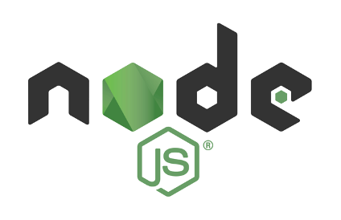
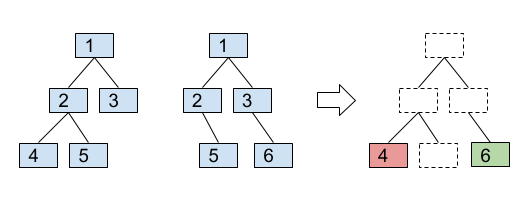
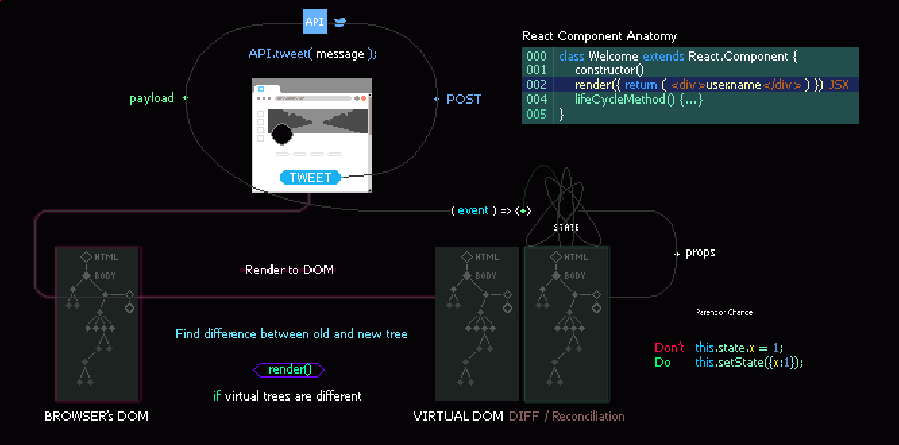
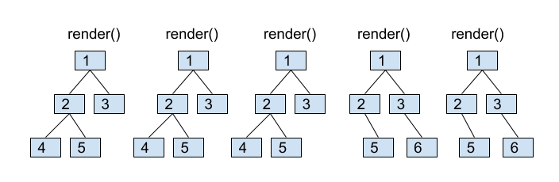
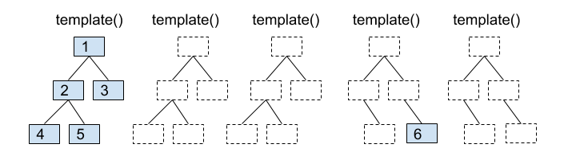

# Minigram

---?color=linear-gradient(90deg, #5384AD 65%, white 35%)
@title[Agenda]

@snap[north-west h4-white]

#### Agenda

@snapend

@snap[west span-55]
@ul[list-spaced-bullets text-white text-04]
- Current state of Mitigram Web
- Modern JavaScript
- ES2015 (ES6) and beyond...
- TypeScript
- Package management, bundling, task runners and transpiling
- Frontend libraries and frameworks
- Minigram project - React, Vue, Angular
- Redux and virtual DOM
- Feature comparison and discussion
- Bring Mitigram in to the modern era
- Web Components
@ulend
@snapend

@snap[east span-45]
@img[shadow](assets/img/JSLogo.png)
@snapend

---?color=#000

@snap[midpoint]
The current state of Mitigram Web
@snapend

---

### Using JavaScript the “old-school” way

```HTML
<!-- index.html -->
<!DOCTYPE html>
<html lang="en">
<head>
  <meta charset="UTF-8">
  <title>Mitigram Marketplace</title>
  <script src="index.js"></script>
</head>
<body>
  <h1>Hello from HTML!</h1>
</body>
</html>
```

---

```JavaScript
// index.js
console.log("Hello from JavaScript!");
```

---

### Including Moment.js

```HTML
<!-- index.html -->
<!DOCTYPE html>
<html lang="en">
<head>
  <meta charset="UTF-8">
  <title>Mitigram Marketplace</title>
  <script src="moment.min.js"></script>
  <script src="index.js"></script>
</head>
<body>
  <h1>Hello from HTML!</h1>
</body>
</html>
```

---

```JavaScript
// index.js
console.log("Hello from JavaScript!");
console.log(moment().startOf('day').fromNow());
```

---

@snap[midpoint span-50 text-07]
@ul
- Note that _moment.min.js_ **must be loaded** before _index.js_, so you can use the _moment function_ in _index.js_.
- The good thing is that this easy enough to understand.
- The bad thing is that it is annoying to find and download new versions of libraries every time they would update.
@ulend
@snapend

---

### Package management

---

@snap[midpoint span-60 text-07]
@ul
- Bower - 2013 - https://bower.io/
- npm - 2015 - https://www.npmjs.com/
- yarn - 2016 - https://yarnpkg.com
@ulend
@snapend

---

#### Using NPM

```
$ npm init // generate package.json
```

```JSON
{
  "name": "your-project-name",
  "version": "1.0.0",
  "description": "",
  "main": "index.js",
  "scripts": {
    "test": "echo \"Error: no test specified\" && exit 1"
  },
  "author": "",
  "license": "ISC"
}
```

---

#### Installing moment using NPM

```
$ npm install moment --save
```

```JSON
{
  "name": "modern-javascript-example",
  "version": "1.0.0",
  "description": "",
  "main": "index.js",
  "scripts": {
    "test": "echo \"Error: no test specified\" && exit 1"
  },
  "author": "",
  "license": "ISC",
  "dependencies": {
    "moment": "^2.22.2"
  }
}
```

---

#### Using moment from NPM

```HTML
<!-- index.html -->
<!DOCTYPE html>
<html lang="en">
<head>
  <meta charset="UTF-8">
  <title>JavaScript Example</title>
  <script src="node_modules/moment/min/moment.min.js"></script>
  <script src="index.js"></script>
</head>
<body>
  <h1>Hello from HTML!</h1>
</body>
</html>
```

---?color=linear-gradient(90deg, white 50%, black 50%)

@snap[west span-50 text-center text-06]

The good thing is that we can now use **npm** to download and update our packages through the command line.

@snapend

@snap[east span-50 text-center text-06 text-white]

The bad thing is right now we’re digging through the **node_modules** folder to find the location of each package and manually including it in our HTML.

@snapend

---

@snap[north span-40]
#### Using a JavaScript module bundler
@snapend

@snap[west span-40 text-08]
Most programming languages, provide a way to import code from one file into another.
@snapend

@snap[east span-40 text-08]

```csharp
using App.Application.Contracts;
using App.Application.Interface.Models;
using App.Enumerations;
using Newtonsoft.Json;
using System;
using System.Threading.Tasks;
using System.Web.Mvc;
using TypeLess;
```
@snapend

---

---?color=linear-gradient(90deg, white 50%, black 50%)

@snap[west span-40 text-center text-06]
@ul
- JavaScript wasn’t originally designed with this feature.
- JavaScript was designed to only run in the browser.
- No access to the file system of the client’s computer for security reasons.
@ulend
@snapend

@snap[east span-40 text-white text-06]
@ul
- Organizing JavaScript code in multiple files required you to load each file with variables shared globally.
- In 2009 a project named **CommonJS** was started with the goal of specifying an ecosystem for JavaScript outside the browser.
- The most well-known of implementation of CommonJS modules is **node.js**.
@ulend
@snapend

---?color=linear-gradient(180deg, white 50%, #718C00 50%)

@snap[north span-85]

@snapend

@snap[midpoint span-85 bg-white shadow]

```JavaScript
// index.js
var moment = require('moment');
console.log("Hello from JavaScript!");
console.log(moment().startOf('day').fromNow());
```

@snapend
@snap[south span-85 text-06 text-white]
@ul
- This is all great for **node.js**, but if you tried to use the above code in the browser, you’d get an error saying _require is not defined_.
- The browser doesn’t have access to the file system.
- This is where a _module bundler_ comes in.
@ulend
@snapend

---

@snap[midpoint span-50 text-07]
@ul
- We need a module bundler to find all require statements and replace them with the actual contents of each required file.
- Around 2015, **webpack** eventually became the more widely used module bundler.
- Fueled by the popularity of the **React** frontend framework, which took full advantage of webpack’s various features.
@ulend
@snapend

---

```
$ npm install webpack webpack-cli --save-dev
```
```JSON
{
  "name": "modern-javascript-example",
  "version": "1.0.0",
  "description": "",
  "main": "index.js",
  "scripts": {
    "test": "echo \"Error: no test specified\" && exit 1"
  },
  "author": "",
  "license": "ISC",
  "dependencies": {
    "moment": "^2.19.1"
  },
  "devDependencies": {
    "webpack": "^4.17.1",
    "webpack-cli": "^3.1.0"
  }
}
```
---

@snap[north span-80]
```
$ ./node_modules/.bin/webpack index.js --mode=development
```
@snapend

@snap[midpoint span-50 text-07]
This command will run the webpack tool that was installed in the _node_modules_ folder start with the index.js file, find any require statements, and replace them with the appropriate code to create a single output file (which by default is _dist/main.js_).
@snapend

---

```HTML
<!-- index.html -->
<!DOCTYPE html>
<html lang="en">
<head>
  <meta charset="UTF-8">
  <title>JavaScript Example</title>
  <script src="dist/main.js"></script>
</head>
<body>
  <h1>Hello from HTML!</h1>
</body>
</html>
```
---

@snap[north span-80]
```
$ ./node_modules/.bin/webpack index.js --mode=development
```
@snapend

@snap[midpoint span-50 text-07]
Note that we’ll need to run the webpack command each time we change _index.js_.
This is tedious, and will get even more tedious as we use webpack’s more advanced features like generating source maps.
@snapend

---

@snap[north]
```JavaScript
// webpack.config.js
module.exports = {
  mode: 'development',
  entry: './index.js',
  output: {
    filename: 'main.js',
    publicPath: 'dist'
  }
};
```
@snapend

@snap[midpoint span-50 text-07]
```
$ ./node_modules/.bin/webpack
```
@snapend

---

@snap[north]
#### Advantages of bundling
@snapend

@snap[midpoint span-50 text-07]
@ul
- We are no longer loading external scripts via global variables (yay!)
- Any new JavaScript libraries will be added using require statements in the JavaScript
- Having a single JavaScript bundle file is often better for performance.
- And now that we added a build step, there are some other powerful features we can add to our development workflow!
- Transpiling code for new language features - ES6 and beyond!
@ulend
@snapend
---

@snap[north]
#### JavaScript versions
@snapend

@snap[midpoint span-80 text-04]

|     |                       |                                                                                                                     |     |     |
| --- | --------------------- | ------------------------------------------------------------------------------------------------------------------- | --- | --- |
| 1   | ECMAScript 1 (1997)   | First Edition.                                                                                                      |     |     |
| 2   | ECMAScript 2 (1998)   | Editorial changes only.                                                                                             |     |     |
| 3   | ECMAScript 3 (1999)   | Added Regular Expressions.Added try/catch.                                                                          |     |     |
| 4   | ECMAScript 4          | Never released.                                                                                                     |     |     |
| 5   | ECMAScript 5 (2009)   | Added "strict mode". Added JSON support. Added String.trim(). Added Array.isArray(). Added Array Iteration Methods. |     |     |
| 5.1 | ECMAScript 5.1 (2011) | Editorial changes.                                                                                                  |     |     |
| 6   | ECMAScript 2015       | Added let and const. Added default parameter values. Added Array.find(). Added Array.findIndex().                   |     |     |
| 7   | ECMAScript 2016       | Added exponential operator (\*\*). Added Array.prototype.includes.                                                  |     |     |
| 8   | ECMAScript 2017       | Added string padding. Added new Object properties. Added Async functions. Added Shared Memory.                      |     |     |
| 9   | ECMAScript 2018       | Added rest / spread properties. Added Asynchronous iteration. Added Promise.finally(). Additions to RegExp.         |     |     |

@snapend
---

@snap[north]
#### Browser support
@snapend

@snap[midpoint span-80 text-06]
@ul
- ECMAScript 3 is fully supported in all browsers.
- ECMAScript 5 is fully supported in all modern browsers (https://caniuse.com/#feat=es5) .
- JavaScript has had modules for a long time implemented via libraries (require.js), not built into the language.
- ES6 is the first time that JavaScript has built-in modules.
- Safari 10 and Edge 14 were the first browsers to fully support ES6 (https://caniuse.com/#feat=es6).
- Surprise, surprise... *Internet Explorer does not support ES6*. :-(
- Chrome 68 and Opera 55 support ES7.
@ulend
@snapend
---

### Notable features

#### ECMAScript 2015 (ES6)

---

@snap[north]
#### Let + Const
@snapend

@snap[midpoint span-80 text-06]
The *let* statement allows you to declare a variable with block scope.

*Constants* are similar to let variables, except that the value cannot be changed.

```JavaScript
function f() {
  {
    let x;
    {
      // okay, block scoped name
      const x = "sneaky";
      // error, const
      x = "foo";
    }
    // error, already declared in block
    let x = "inner";
  }
}
```
@snapend

---

@snap[north]
#### Arrows
@snapend

@snap[midpoint span-80 text-06]
**Arrows** are a function shorthand using the => syntax. You don't need the function keyword, the return keyword, and the curly brackets. 

Unlike functions, arrows share the same lexical this as their surrounding code.

```JavaScript
// ES5
var x = function(x, y) {
   return x * y;
}

// ES6
const x = (x, y) => x * y;

// Lexical this
const bob = {
  _name: "Bob",
  _friends: ["Dady"],
  printFriends() {
    this._friends.forEach(f =>
      console.log(this._name + " knows " + f));
  }
}
```
@snapend

---

@snap[north]
#### Classes
@snapend

@snap[midpoint span-80 text-06]
ES6 classes are a simple sugar over the prototype-based OO pattern. Classes support prototype-based inheritance, super calls, instance and static methods and constructors.

```JavaScript
class Car {
  constructor(brand) {
    this.carname = brand;
  }
}
mycar = new Car("Saab");
```
@snapend

---

@snap[north]
#### Template strings
@snapend

@snap[midpoint span-80 text-06]
```TypeScript
// Basic literal string creation
`In JavaScript '\n' is a line-feed.`

// Multiline strings
`In JavaScript this is
 not legal.`

// String interpolation
var name = "Bob", time = "today";
console.log(`Hello ${name}, how are you ${time}?`)
```
@snapend

---

@snap[north]
#### Map + Set + WeakMap + WeakSet
@snapend

@snap[midpoint span-80 text-06]
Efficient data structures for common algorithms. WeakMaps provides leak-free object-key’d side tables.

```JavaScript
// Sets
var s = new Set();
s.add("hello").add("goodbye").add("hello");
s.size === 2;
s.has("hello") === true;

// Maps
var m = new Map();
m.set("hello", 42);
m.set(s, 34);
m.get(s) == 34;

// Weak Maps
var wm = new WeakMap();
wm.set(s, { extra: 42 });
wm.size === undefined

// Weak Sets
var ws = new WeakSet();
ws.add({ data: 42 });
// Because the added object has no other references, it will not be held in the set
```
@snapend

---

@snap[north]
#### Default + Rest + Spread
@snapend

@snap[midpoint span-80 text-06]
Callee-evaluated default parameter values. 
Turn an array into consecutive arguments in a function call. 
Bind trailing parameters to an array. 
Rest replaces the need for arguments and addresses common cases more directly.

```JavaScript
function f(x, y=12) {
  // y is 12 if not passed (or passed as undefined)
  return x + y;
}
f(3) == 15
function f(x, ...y) {
  // y is an Array
  return x * y.length;
}
f(3, "hello", true) == 6
function f(x, y, z) {
  return x + y + z;
}
// Pass each elem of array as argument
f(...[1,2,3]) == 6
```
@snapend

---

@snap[north]
#### Promises
@snapend

@snap[midpoint span-80 text-06]
Promises are a library for asynchronous programming. 
Promises are a first class representation of a value that may be made available in the future. 
Promises are used in many existing JavaScript libraries like jQuery.

```JavaScript
function timeout(duration = 0) {
    return new Promise((resolve, reject) => {
        setTimeout(resolve, duration);
    })
}

var p = timeout(1000).then(() => {
    return timeout(2000);
}).then(() => {
    throw new Error("hmm");
}).catch(err => {
    return Promise.all([timeout(100), timeout(200)]);
})
```
@snapend

---

@snap[north]
#### Modules
@snapend

@snap[midpoint span-80 text-06]
Language-level support for modules for component definition.

```JavaScript
// lib/math.js
export function sum(x, y) {
  return x + y;
}
export var pi = 3.141593;
```

```JavaScript
// app.js
import * as math from "lib/math";
alert("2π = " + math.sum(math.pi, math.pi));
```

```JavaScript
// otherApp.js
import {sum, pi} from "lib/math";
alert("2π = " + sum(pi, pi));
```
@snapend

---
@snap[north]
#### Some advantages of using modules
@snapend

@snap[midpoint span-80 text-06]
@ul
- Code can be split into smaller files of self-contained functionality.
- Multiple scripts can be concatenated thereby increasing performance.
- Debugging becomes easier.
- Any code referencing a module understands it is a dependency. If the module file is changed or moved, the problem is immediately obvious.
- Modules (usually) helps eradicate naming conflicts. Function _sumAll()_ in _module1_ cannot clash with function _sumAll()_ in _module2_. Aliases are very useful here, it becomes _module1.sumAll()_ and _module2.sumAll()_.
- ES6 Modules are always executed in strict mode, so there is no need for ‘use strict’ .
- ES6 modules help you to organize your code better
@ulend
@snapend

---

### Notable features ECMAScript 2016-2019

---

@snap[north]
#### ES2016 - Array.prototype.includes
@snapend

@snap[midpoint span-80 text-06]

```JavaScript
[1, 2, 3].includes(-1)                   // false
[1, 2, 3].includes(1)                    // true
[1, 2, 3].includes(3, 4)                 // false
[1, 2, 3].includes(3, 3)                 // false
[1, 2, NaN].includes(NaN)                // true
['foo', 'bar', 'quux'].includes('foo')   // true
['foo', 'bar', 'quux'].includes('norf')  // false
```
@snapend

---

@snap[north]
#### ES2017 - async await
@snapend

@snap[midpoint span-80 text-06]

An asynchronous function is a function which operates asynchronously via the event loop, using an implicit Promise to return its result.

```JavaScript
function resolveAfter2Seconds() {
  return new Promise(resolve => {
    setTimeout(() => {
      resolve('resolved');
    }, 2000);
  });
}

async function asyncCall() {
  console.log('calling');
  var result = await resolveAfter2Seconds();
  console.log(result);
  // expected output: 'resolved'
}

asyncCall();

```
@snapend

---

@snap[north]
#### ES2018 -- Promise prototype finally
@snapend

@snap[midpoint span-80 text-06]

Promise API is extended by an optional finally block which is called in any case (after the Promise is resolved or is rejected).

```JavaScript
function testFinally() {
  return new Promise((resolve,reject) => resolve())
}

testFinally().then(() => console.debug("resolved")).finally(() => console.debug("finally"))
// resolved
// finally

```

@snapend

---

@snap[north]
#### ES2019 -- Array.prototype.{flat,flatMap}
@snapend

@snap[midpoint span-80 text-06]
The _flat()_ method enables you to easily concatenate all sub-array elements of an array.

```JavaScript
let arr = ['a', 'b', ['c', 'd']];
let flattened = arr.flat();

console.log(flattened);    // => ["a", "b", "c", "d"]

const arr = [4.25, 19.99, [25.5]];

console.log(arr.flatMap(value => [Math.round(value)]));
// => [4, 20, 26]
```
@snapend

---

@snap[north]
#### ES2019 -- Object.fromEntries
@snapend

@snap[midpoint span-80 text-06]

```JavaScript
const myArray = [['one', 1], ['two', 2], ['three', 3]];
const obj = Object.fromEntries(myArray);

console.log(obj); // => {one: 1, two: 2, three: 3}
```
@snapend

---

@snap[north]
#### ... and more
@snapend

@snap[midpoint span-80 text-06]
https://www.w3schools.com/js/js_es6.asp
https://github.com/daumann/ECMAScript-new-features-list/blob/master/ES2015.MD
@snapend

---

@snap[north]
#### Transpiling
@snapend

@snap[midpoint span-80 text-06]

Transpiling code means converting the code in one language to code in another similar language.
@ul
- CoffeeScript - 2010 - http://coffeescript.org/
- TypeScript - 2012 - https://www.typescriptlang.org
- babel - 2014 - https://babeljs.io/
@ulend
@snapend

---

@snap[north]
#### TypeScript
@snapend

@snap[midpoint span-80 text-06]
@ul
- TypeScript is a strict syntactical superset of JavaScript, and adds optional static typing to the language.
- Provide an optional type system for JavaScript.
- Provide planned features from future JavaScript editions to current JavaScript engines.
- TypeScript was first made public in October 2012 (at version 0.8), after two years of internal development at Microsoft.
- TypeScript 1.0 was released at Microsoft's Build developer conference in 2014.
- Designed by Anders Hejlsberg.
- The TypeScript compiler is itself written in TypeScript and compiled to JavaScript. 
@ulend
@snapend

---

https://www.typescriptlang.org/play/

---

@snap[north]
#### Type annotations
@snapend

@snap[midpoint span-80 text-06]
```TypeScript
/// greeter.ts
greeter(person: string) => "Hello, " + person;

let user = "Slim Dady";

console.log(greeter(user));
```

```
tsc greeter.ts
```
@snapend

---

@snap[north]
### Interfaces
@snapend

@snap[midpoint span-80 text-06]

```TypeScript
interface Person {
    firstName: string;
    lastName: string;
}

function greeter(person: Person) {
    return "Hello, " + person.firstName + " " + person.lastName;
}

let user = { firstName: "Slim", lastName: "Dady" };

console.log(greeter(user));
```

@snapend

---

@snap[north]
### Classes
@snapend

@snap[midpoint span-80 text-06]

```TypeScript
class Cop {
    fullName: string;
    constructor(public firstName: string, public middleInitial: string, public lastName: string) {
        this.fullName = firstName + " " + middleInitial + " " + lastName;
    }
}

interface Cop {
    firstName: string;
    lastName: string;
}

function greeter(person: Cop) {
    return "Hello, " + person.firstName + " " + person.lastName;
}

let copDog = new Cop("Dog", "M.", "Cop");

console.log(greeter(copDog));
```

@snapend

---
@snap[north]
#### Using TypeScript with Webpack
@snapend

@snap[midpoint span-80 text-06]

```
npm install -g typescript
```

```
$ npm install --save-dev typescript ts-loader source-map-loader
```

*tsconfig.json*

```JSON
{
    "compilerOptions": {
        "outDir": "./dist/",
        "sourceMap": true,
        "noImplicitAny": true,
        "module": "commonjs",
        "target": "es6"
    }
}
```
@snapend

---
@snap[midpoint span-80 text-06]

```JavaScript
// webpack.config.js
module.exports = {
    mode: "production",

    // Enable sourcemaps for debugging webpack's output.
    devtool: "source-map",

    resolve: {
        // Add '.ts' and '.tsx' as resolvable extensions.
        extensions: [".ts", ".tsx"]
    },

    module: {
        rules: [
            {
                test: /\.ts(x?)$/,
                exclude: /node_modules/,
                use: [
                    {
                        loader: "ts-loader"
                    }
                ]
            },
            // All output '.js' files will have any sourcemaps re-processed by 'source-map-loader'.
            {
                enforce: "pre",
                test: /\.js$/,
                loader: "source-map-loader"
            }
        ]
    }
};
```

```
$ ./node_modules/.bin/webpack
```
@snapend

---

### Demo Time

---

@snap[north]
#### TypeScript project with webpack
@snapend

@snap[midpoint span-40 text-06]


@snapend

---

@snap[north]
#### Frontend libraries
@snapend

@snap[midpoint span-80 text-06]
@ul
- 2005 Prototype
- 2005 Dojo
- 2006 jQuery
- 2006 Microsoft ASP.NET Ajax (Atlas)
- 2006 YUI Library
- 2007 MooTools
- 2007 GWT
- 2007 jQuery UI
- 2010 KnockoutJS
- 2010 Backbone.js
- 2010 Angular.js
- 2011 Ember.js
- 2011 Kendo UI
- 2013 React
- 2014 Vue
- 2016 Angular
- 2016 Svelte
- 2020 Blazor WebAssembly
@ulend
@snapend

---

@snap[north]
#### Modern frontend libraries and frameworks
@snapend

@snap[midpoint span-80 text-06]
@ul
- Single Page App / PWA
- webpack
- CLI
- Babel and TypeScript
- Virtual DOM
- Scoped CSS
- Data-driven templates (like JSX)
- Redux
- SSR - server-side rendering
@ulend
@snapend

---

@snap[north]
#### Don't *EVER* touch the DOM
@snapend

@snap[midpoint span-80 text-06]
@ul
- Layout thrashing and browser must redraw which is expensive
- Kills performance and drains battery on lower-end devices
- Jank - we want 60 fps!
- Prevents from using another underlying rendering system (eg. native rendering)
- For example does not play well with SSR, because there is no DOM on the server
@ulend
@snapend

---

@snap[north]
#### Virtual DOM (React, VUE)
@snapend

@snap[midpoint span-80 text-06]
@ul
- Every component creates a new virtual DOM tree every time it gets rerendered. 
- React compares the new virtual DOM tree with the old one and then applies a series of transformations to the browser DOM to match the new virtual DOM tree.
- We can use any programming language to implement the component’s render function, so we don’t need to compile anything. - React developers mainly uses JSX, but we can use plain JavaScript as well.
- We get a value as a result of rendering component. It can be used for testing, debugging, etc..
@ulend


@snapend

---



---

@snap[north]
#### Incremental DOM 
@snapend

@snap[midpoint span-80 text-06]
@ul
- Every component gets compiled into a series of instructions. These instructions create DOM trees and update them in-place when the data changes.
- Virtual DOM requires an interpreter. What part of that interpreter is needed and what part is not isn’t known at compile time, so we have to ship the whole thing to the browser.
- Applications have to perform well on mobile devices. This mainly meant optimizing two things: the bundle size and the memory footprint.
- The rendering engine itself has to be tree shakable
- The rendering engine has to have low memory footprint
@ulend
@snapend

---

@snap[midpoint span-80 text-06]




@snapend

---

@snap[north]
#### React
@snapend

@snap[midpoint span-80 text-06]

React is a JavaScript library developed and maintained by Facebook.

@ul
JSX + JS (ES5/ES6)
- Virtual DOM
- Unidirectionl binding / one way data flow e.g. Redux
- No dependency injection
- Fetch for HTTP requests
- Template, logic in one file
@ulend
@snapend

---

@snap[midpoint span-80 text-06]
```JavaScript
ReactDOM.render(
  <h1>Hello, Slim Dady!</h1>,
  document.getElementById('root')
);
```

```JavaScript
const name = 'Slim Dady';
const element = <h1>Hello {name}</h1>;

ReactDOM.render(
  element,
  document.getElementById('root')
);
```
@snapend

---

@snap[north]
#### Vue
@snapend

@snap[midpoint span-80 text-06]
@ul
- Two-way databinding
- Templates
- Directives
- Mixins
- Routing
- CSS encapsulation
- Fetch for HTTP requests
- Template, logic and styles in one file
@ulend
@snapend

---

```HTML
<div id="app">
  {{ message }}
</div>
```

```JavaScript
var app = new Vue({
  el: '#app',
  data: {
    message: 'Hello Slim Dady!'
  }
})
```

---

@snap[north]
#### Angular
@snapend

@snap[midpoint span-80 text-06]
Angular is a fully-fledged MVC framework written in TypeScript

@ul
- Two-way databinding
- Templates
- Directives
- Dependency injection
- CSS encapsulation
- Template, logic and styles in separate files
- HTTP request module (Fetch with fallback to XHR)
- Routing
- Form building
- Schematics
- Angular Elements
@ulend
@snapend

---

```HTML
<div id="app">
  {{ message }}
</div>
```

```TypeScript
import { Component, Input } from '@angular/core';

@Component({
  selector: 'hello',
  template: `<h1>Hello {{name}}!</h1>`,
  styles: [`h1 { font-family: Lato; }`]
})
export class HelloComponent  {
  @Input() name: string = 'Slim Dady';
}
```

```
https://stackblitz.com/
```

---

@snap[north]
### Svelte

```HTML
<script>
	let name = 'Slim Dady';
</script>


<h1>Hello {name}!</h1>
```

@snap[north]
#### Minigram
@snapend

@snap[midpoint span-80 text-06]
@ul
- Small clone of Mitigram with limited functionality
- Written in React, Vue and Angular for comparison
- User authentication with fake backend
- Semantic UI
- Kendo UI (Charts, Modals and everyone's favorite - the Grid)
- Routing
- Redux for authentication
@ulend
@snapend

---

@snap[north]
#### Component Testing (with Angular)
@snapend

@snap[midpoint span-80 text-06]
@ul
- An isolated test that only focuses on the component’s class.
- The shadow test that focuses on the component’s class and its template, without its dependencies by mocking them.
- An integrated test will test the component and its dependencies as a whole.
@ulend
@snapend

---

@snap[north]
#### Web components
@snapend

@snap[midpoint span-80 text-06]
@ol
- *HTML Template*: The overall template of a web component. Angular has ng template, sort of similar.
- *Shadow DOM*: Maintain a DOM in memory, but not on the main DOM. Great for performance.
- *HTML Imports*: Import/export reusable bits of HTML. Hardly anyone uses it.
- *Custom Elements*: Ability to add to the vernacular of HTML, basically allows you to define a web component.
@olend
@snapend

---

```JavaScript
class myElement extends HTMLElement {}
window.customElements.define(‘my-element’, myElement);
```

```JavaScript
class MyElement extends HTMLElement {
static get observedAttributes():string[]{ return [‘some-attribute’] }
attributeChangedCallback(oldvalue, newvalue, key) {}}
```

```HTML
<my-element some-attribute=”somevalue”></my-element>
```

---
@snap[north]
#### Angular Elements
@snapend

@snap[midpoint span-80 text-06]
Angular Elements are simply an Angular component, but packaged as a Web Component.
@snapend

---

@snap[midpoint span-80 text-06]
@ul
- Self-boot strapping: Drop on a page, and it works. Unlike full Angular, they don’t need complex boot strapping logic.
- Hosts an Angular component inside a web component
- Provides a bridge from angular concepts to web components.
- Zones are not needed.
- Angular on the inside, standards on the outside … SO … they can work and play well with basic HTML and any other existing project!
@ulend
@snapend

---

@snap[midpoint span-80 text-06]
```
ng new angularElements
```

```
ng add @angular/elements
```
@snapend

@snap[north]
#### Conslusion
@snapend

@snap[midpoint span-80 text-06]
@ul
- React and Vue are libra and surrounding code
- No native Typescript support but can be added (Vue 3 is written in TS)
- Angular allows for 
- Dependices are updated infrequently, may be abonondon and needs replacement


@ulend
@snapend

## Add Some Slide Candy


---?color=linear-gradient(180deg, white 75%, black 25%)
@title[Customize Slide Layout]

@snap[west span-50]

## Customize the Layout

@snapend

@snap[east span-50]

@snapend

@snap[south span-100 text-white]
Snap Layouts let you create custom slide designs directly within your markdown.
@snapend

---?color=linear-gradient(90deg, #5384AD 65%, white 35%)
@title[Add A Little Imagination]

@snap[north-west h4-white]

#### And start presenting...

@snapend

@snap[west span-55]
@ul[list-spaced-bullets text-white text-09]

- You will be amazed
- What you can achieve
- _With a little imagination..._
- And **GitPitch Markdown**
  @ulend
  @snapend

@snap[east span-45]
@img[shadow](assets/img/conference.png)
@snapend

---

@snap[north-east span-100 text-pink text-06]
Let your code do the talking!
@snapend

```sql zoom-18
CREATE TABLE "topic" (
    "id" serial NOT NULL PRIMARY KEY,
    "forum_id" integer NOT NULL,
    "subject" varchar(255) NOT NULL
);
ALTER TABLE "topic"
ADD CONSTRAINT forum_id
FOREIGN KEY ("forum_id")
REFERENCES "forum" ("id");
```

@snap[south span-100 text-gray text-08]
@[1-5](You can step-and-ZOOM into fenced-code blocks, source files, and Github GIST.)
@[6,7, zoom-13](Using GitPitch live code presenting with optional annotations.)
@[8-9, zoom-12](This means no more switching between your slide deck and IDE on stage.)
@snapend

---?image=assets/img/presenter.jpg

@snap[north span-100 h2-white]

## Now It's Your Turn

@snapend

@snap[south span-100 text-06]Click here to jump straight into the interactive feature guides in the GitPitch Docs @fa[external-link]](https://gitpitch.com/docs/getting-started/tutorial/)
@snapend

https://blog.nrwl.io/understanding-angular-ivy-incremental-dom-and-virtual-dom-243be844bf36
